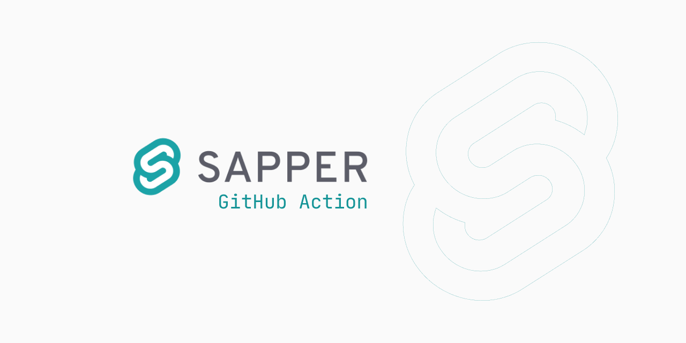

# GitHub Action for Sapper

Use this action to build your static website with [Sapper](https://sapper.svelte.dev/).



## ☝️ How to use?

To use it, create a `.github/workflows/sapper_build.yml` file in your Sapper-based website repository as an action.

> 📌 **Tip**: read [this article](https://help.github.com/en/articles/workflow-syntax-for-github-actions#jobsjob_idsteps) to more understand GitHub Actons steps.

## ⚙️ Inputs

This action accepts a couple of _optional_ inputs:

| Input Name   | Required? |   Default    | Description                                             |
| ------------ | :-------: | ---------- | ------------------------------------------------------- |
| `build_mode` |    No     |  `"export"`  | Build mode to the Sapper |
| `args`       |    No     | `"--legacy"` | Arguments to pass to the Sapper invocation              |

For example:

```yaml
- name: Build
  uses: truewebartisans/actions-sapper@master
  with:
    build_mode: "export"
    args: "--legacy --entry about"
```

## 👀 More complex examples

These are examples, which _builds the website_ with this action, then deploys with another action.

### 💡 Deploy to GitHub Pages

- Deploy action: [peaceiris/actions-gh-pages](https://github.com/peaceiris/actions-gh-pages)

```yaml
name: Build Sapper and Deploy to GitHub Pages

on: [push]

jobs:
  build_deploy:
    runs-on: ubuntu-latest
    steps:
      - uses: actions/checkout@master
      - name: Build Sapper
        uses: truewebartisans/actions-sapper@master
      - name: Deploy to GitHub Pages
        uses: peaceiris/actions-gh-pages@master
        env:
          PUBLISH_DIR: __sapper__/export
          PUBLISH_BRANCH: gh-pages
          GITHUB_TOKEN: ${{ secrets.GITHUB_TOKEN }}
```

### 💡 Deploy to remote virtual server (VDS/VPS/Droplet) via SSH

- Deploy action: [appleboy/scp-action](https://github.com/appleboy/scp-action)

```yaml
name: Build Sapper and Deploy to remote virtual server via SSH

on: [push]

jobs:
  build_deploy:
    runs-on: ubuntu-latest
    steps:
      - uses: actions/checkout@master
      - name: Build Sapper
        uses: truewebartisans/actions-sapper@master
        with:
          build_mode: "build"
      - name: Deploy to remote virtual server via SSH
        uses: appleboy/scp-action@master
        with:
          host: ${{ secrets.REMOTE_HOST }}
          username: ${{ secrets.REMOTE_USER }}
          key: ${{ secrets.SSH_KEY }}
          passphrase: ${{ secrets.SSH_KEY_PASSPHRASE }}
          rm: true
          source: __sapper__/build/
          target: ${{ secrets.REMOTE_DIR }}
```

## 📚 License

MIT &copy; [Vic Shóstak](https://github.com/koddr) & [True web artisans](https://1wa.co/).
